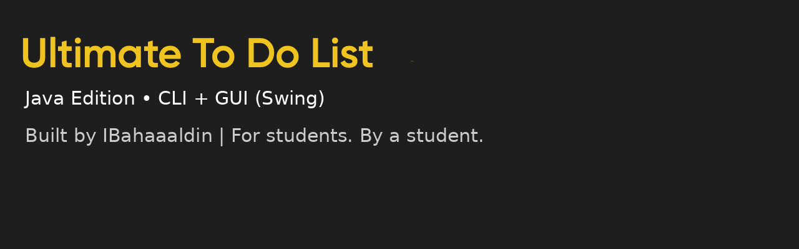
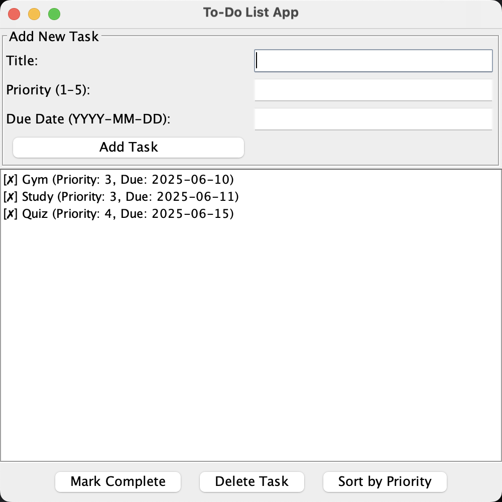

# ✅ Ultimate To-Do App (Java Version)




A full-featured Java-based task management program for users who want a simple but powerful way to stay organized. Includes both a command-line interface and a GUI built with Java Swing.

---

## 👤 About the Developer

This project was created by **IBahaaaldin**, a second-year Computer Science student with a growing portfolio of real-world projects. Passionate about building clean, efficient, and creative tools that help people manage their academic and personal life.

---

## 🧠 Project Overview

The **Ultimate To-Do App** allows users to:

- Organize tasks by title, priority, and due date
- Use either CLI or GUI interfaces
- Persist tasks between sessions
- Easily mark, delete, sort, and export tasks
- Handle invalid inputs through robust error checks

---

## ✨ Features

### ✅ CLI Version (`ToDoCLI.java`)

- Add/edit/remove tasks
- Prioritize and set due dates
- Save/load tasks from file
- Sort tasks by priority or due date
- Input validation and error handling

### ✅ GUI Version (`ToDoGUI.java`)

- Built using **Java Swing**
- User-friendly interface with labeled input boxes
- Mark as complete / delete buttons
- Task sorting (priority and due date)
- Data persistence via `tasks.txt`

---

## 📷 GUI Screenshot



---

## 📂 File Structure

```
ToDoApp-Java/
├── src/                                # Java source code
│   ├── ToDoCLI.java                    # CLI-based task manager
│   └── ToDoGUI.java                    # GUI version using Swing
│
├── data/                               # Input/output data files
│   └── tasks.txt                       # Saved task data
│
├── assets/                             # Visuals used in documentation
│   ├── java_project_banner.jpg         # Header image for README
│   └── GUI_preview.png                 # GUI screenshot for README
│
├── LICENSE                             # MIT license
└── README.md                           # Main documentation
```

---

## ▶️ How to Run

### Run CLI version:

```bash
javac src/ToDoCLI.java
java -cp src ToDoCLI
```

### Run GUI version:

```bash
javac src/ToDoGUI.java
java -cp src ToDoGUI
```

---

## 📄 License

This project is licensed under the [MIT License](LICENSE).

---

## 🔁 Related Projects

**Check out the Python version of this project:**  
👉 [To-Do App (Python)](https://github.com/IBahaaaldin/To-Do-App-python)
👉 [GPA-Calculator (Java)](https://github.com/IBahaaaldin/GPA-Calculator-java)

---

_This project reflects a student's journey into building real applications with professional structure, creative design, and effective functionality._
